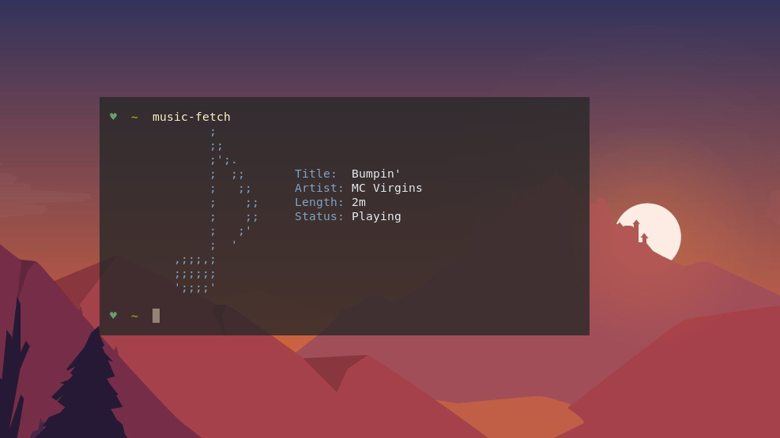

<h1 align=center>Music Fetch</h1>
<p align=center>A simple fetch program for your music!</p>
<h2>Usage</h2>
<br>

Build from source:
```
$ go build cmd/fetch/main.go
$ ./main
```

<h2>Example</h2>


<h2>Contributing</h2>

If you'd like, you can feel free to fill out an [issue](https://gitlab.com/EndowTheGreat/music-fetch/issues/new) if you come across any. If you would like to add more color schemes or features, PRs are absolutely welcome.
